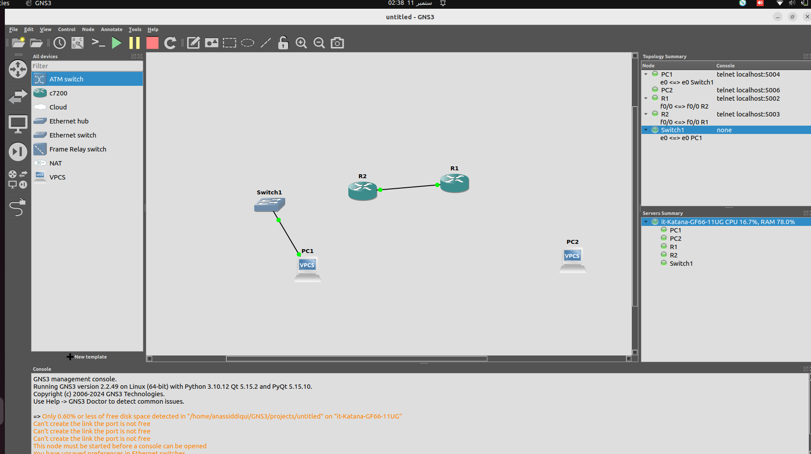
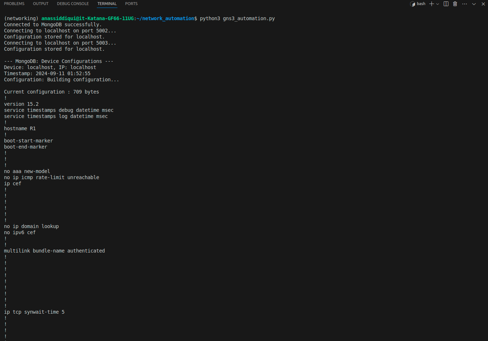

**GNS3 Device Automation with Telnet and **MongoDB**
*Project Overview*

This project automates the configuration retrieval of Cisco devices in GNS3 using Python, Netmiko for SSH connections, and MongoDB for storing device configurations. The script connects to two routers (R1 and R2), retrieves their running configuration, and stores the results in a MongoDB database.

**1. Requirements**
Software Requirements:

Python 3.x
GNS3 (with two network devices, e.g., Cisco routers configured)
MongoDB (running via docker)
Required Python libraries:
netmiko: For Telnet connections
pymongo: For MongoDB operations
use the below commnad to install requirements

pip install -r requirements.txt

**2. Set Up GNS3**
I installed gns3 from official website for linux , add the cisco routers

## Configuring devices 
use the below settings to setup devices you need to open terminal from your device frim gns3 interface 

`enable
configure terminal
line vty 0 4
password admin
login
transport input ssh
exit`

`interface FastEthernet0/0
ip address 192.168.1.1 255.255.255.0
no shutdown
end
write memory`

similiarly setup another device

**3.Setup Mongodb**

use the below command 

1.docker pull mongo
2.docker run --name mongo -d -p 27017:27017 mongo

**4. Run Script**
python gns3_automation.py

In the end I also verified mongo db contents 